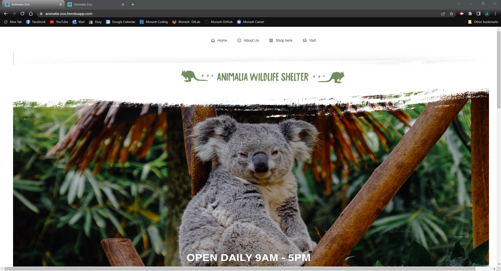
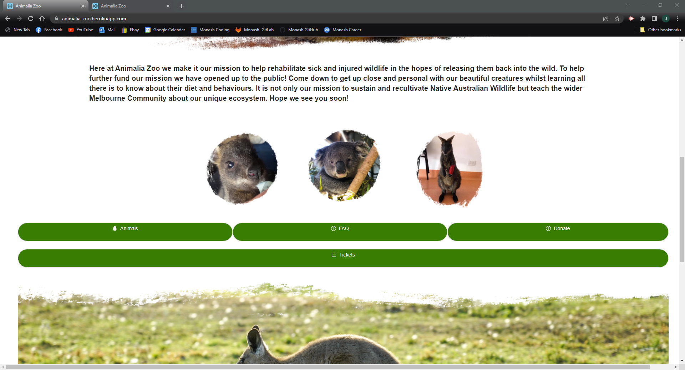
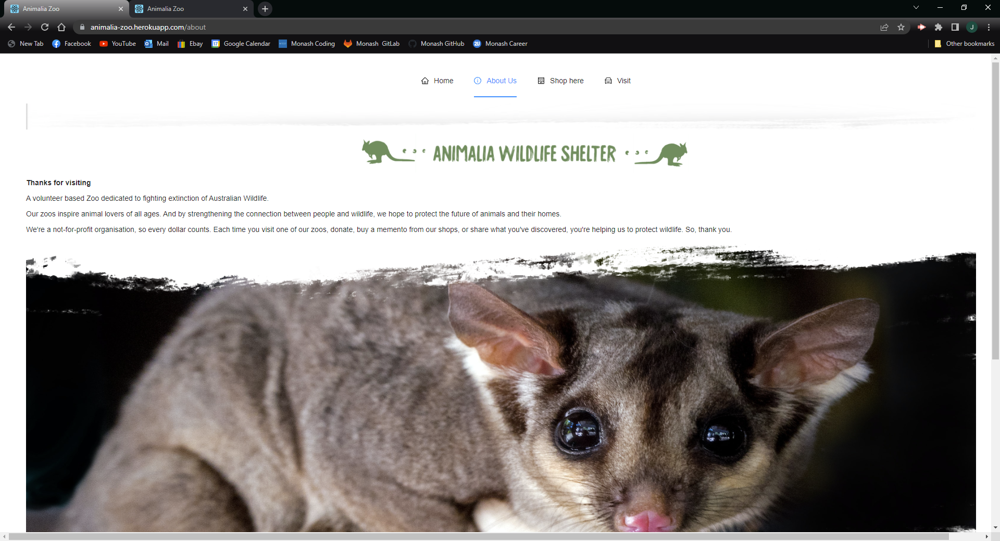
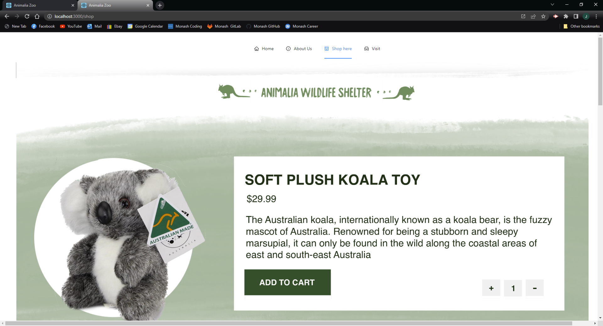
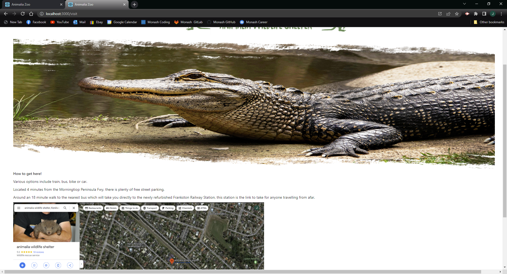
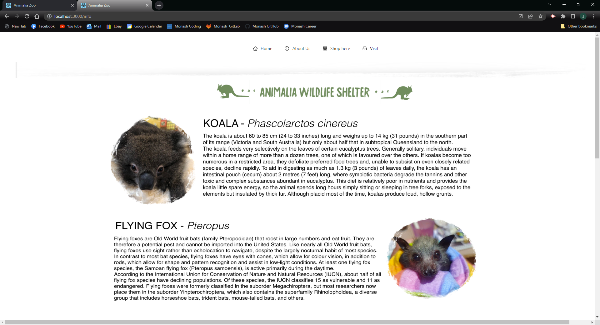
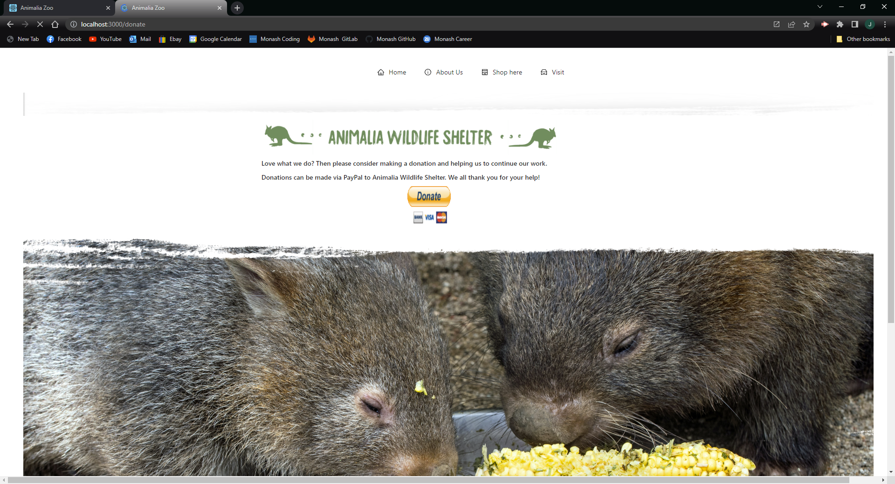

# P3-PROJECT-ANIMAL
## Description
A web application built for a business who is changing from a private volunteer wildlife shelter into a zoo, open to the public.
AS A user
I WANT TO be able to get ample information about the Zoo and shop/buy tickets 
SO THAT I can easily enjoy my purchases and have great knowledge of what I can expect from the Zoo

## Installation
In order to be able to run the app after being cloned you need to run, using node
```
npm install
```
Then to populate seed data and run it the application you can use
```
npm run seed
npm start
```

## Live application link
You can view the live application at: https://animalia-zoo.herokuapp.com/
 
## GitHub
To visit our GitHub repository visit: https://github.com/Jamlit37/P3-PROJECT-ANIMAL/

## Profile
Visit my profile: https://james-little-portfolio.herokuapp.com/

## Contributors

List of contributors is as followed:<br /> 
[James Little](https://github.com/Jamlit37)

## Screenshots of Application







